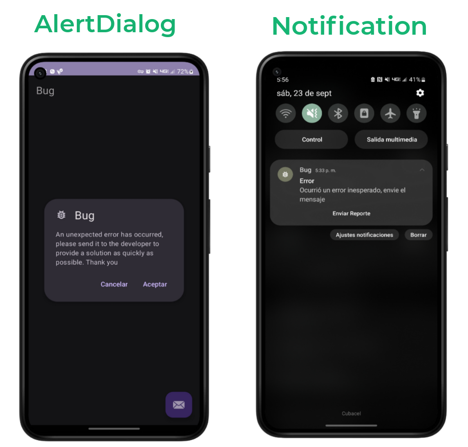

# BugSend
<p align="center">



Una librería sencilla para detectar los errores de su aplicación y enviarlos por correo.

[](https://jitpack.io/#applifycu/bugsend)

</p>

## Agregar

1. Agrega a la raíz de su proyecto

```groovy
allprojects {
  repositories {
    ...
    maven { url 'https://jitpack.io' }
   }
}
```
    
2. Agregar la dependencia a su proyecto
    
```groovy
dependencies {
   implementation 'com.github.applifycu:bugsend:1.0.1'
}
```
    
## Uso

En su `MyApplication.class` agrege

```java
public class MyApplication extends Application {

  @Override
  public void onCreate() {
    super.onCreate();
    
    Thread.setDefaultUncaughtExceptionHandler(new HandlerUtil(this));
    }
}
```
En su MainActivity.class agregue

1 `AlertDialog`

```java
   
 new BugSend(this)
     .setTitle(getString(R.string.title_dialog))
     .setIcon(R.drawable.ic_bug_report_24px)
     .setMessage(getString(R.string.message_dialog))
     .setEmail("soporte@email.com")
     .setSubject("REPORT/APP")
     .setExtraText("EXTRA MESSAGE") // aqui puedes agregar un texto adicional como la versión de la app.
     .show();
     
 ```
 
 2 `Notification`
 
 ```java
 new BugSendNotidication(this)
      .setTitle("title notification")
      .setMessage("message notification")
      .setEmail("soporte@email.com")
      .setSubject("REPORT")
      .setExtraText("extra message") // opcional
      .show();
 
 Su AndroidManifest
 
 ```xml
  <application
    android:name=".MyApplication"
```

### Contacto

Para dudas o sugerencias puede ponerse en contacto con nosotros en:

soporteapplify@gmail.com

### License
 
 ```
Copyright (C) 2023  Applify

This program is free software: you can redistribute it and/or modify
it under the terms of the GNU General Public License as published by
the Free Software Foundation, either version 3 of the License, or
(at your option) any later version.

This program is distributed in the hope that it will be useful,
but WITHOUT ANY WARRANTY; without even the implied warranty of
MERCHANTABILITY or FITNESS FOR A PARTICULAR PURPOSE.  See the
GNU General Public License for more details.

You should have received a copy of the GNU General Public License
along with this program.  If not, see <https://www.gnu.org/licenses/>.
